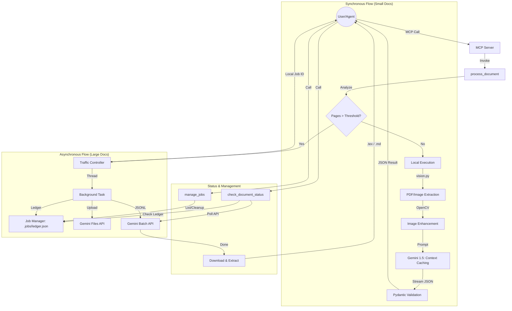

# Images-to-TeX & Markdown (Model Context Protocol)

An advanced semantic document parser and agentic "skill" that transforms images of textbooks, handwritten equations, and notes into strictly separated layers (Base Printed Content vs. Human Annotations) formatted as LaTeX or Markdown.

## 🚀 Overview

This application acts as a high-precision OCR and document interpretation engine powered by **Google Gemini 1.5 Pro/Flash**. It is designed to be used both as a standalone CLI tool and as a **Model Context Protocol (MCP)** server, allowing AI agents (like Claude or Gemini) to interact with physical documents with extreme structural accuracy.

## 🛠 Features

-   **Structural Stratification**: Strictly separates the original printed text from human annotations (handwritten notes, highlights, margin clues).
-   **Dual Mode Extraction**: Generates perfectly formatted LaTeX (for academic typesetting) and Markdown (for web/docs) simultaneously.
-   **Intelligent Vision Pipeline**: Uses OpenCV for denoising, deskewing, and binarization to maximize OCR reliability.
-   **Hybrid Processing Architecture**:
    -   **Synchronous**: Low-latency processing for small documents using **Context Caching** to reduce costs.
    -   **Asynchronous (Batch API)**: Background processing for massive PDFs (50+ pages) to avoid timeouts.
-   **Job Management Ledger**: Centralized tracking of all background jobs in a `.jobs/` directory with a ledger for history and verification.
-   **Self-Correction**: Robust retry logic that feeds linter/parsing errors back to the LLM to fix malformed JSON outputs.

---

## 🏗 How it Works (Architecture)

The following diagram illustrates the flow from an Agent request to the final extracted document:



---

## 📦 Installation

### Prerequisites
- Python 3.10+
- [Poppler](https://github.com/check-repos/poppler) (Required for PDF processing)
  - macOS: `brew install poppler`
  - Linux: `sudo apt-get install poppler-utils`

### Setup
1. **Clone & Install**:
   ```bash
   git clone <repository_url>
   cd docs-to-code
   pip install -r requirements.txt
   ```

2. **Configure Environment**:
   Create a `.env` file in the root:
   ```text
   GOOGLE_API_KEY=your_gemini_api_key_here
   ```

---

## 🤖 MCP Server Usage

This application is built as an MCP server. Add the following to your agent's configuration (e.g., `claude_desktop_config.json`):

```json
{
  "mcpServers": {
    "images-to-tex": {
      "command": "python3",
      "args": ["-m", "src.interfaces.mcp_server"],
      "cwd": "/absolute/path/to/docs-to-code",
      "env": {
        "GOOGLE_API_KEY": "your_api_key_here"
      }
    }
  }
}
```

### Available Tools

| Tool | Description | Key Arguments |
| :--- | :--- | :--- |
| `process_document` | Main entry point for PDF/Image processing. | `document_path`, `mode` (latex/markdown), `threshold_pages` |
| `check_document_status` | Polls status for background/batch jobs. | `job_id`, `output_format` |
| `manage_jobs` | Manages the local `.jobs/` ledger. | `action` (list/cleanup), `job_id` |

---

## 📂 Project Structure

- `src/interfaces/`: Entry points (MCP Server, CLI).
- `src/services/`: Core logic (Vision pipeline, Gemini Intelligence, Batch Processor).
- `src/tools/`: High-level tool implementations.
- `src/models/`: Pydantic data models for structured output.
- `src/utils/`: Shared utilities (Job Manager, LLM prompt engineering).
- `.jobs/`: (Gitignored) Local storage for background job states and ledger.

## 📝 License
MIT
